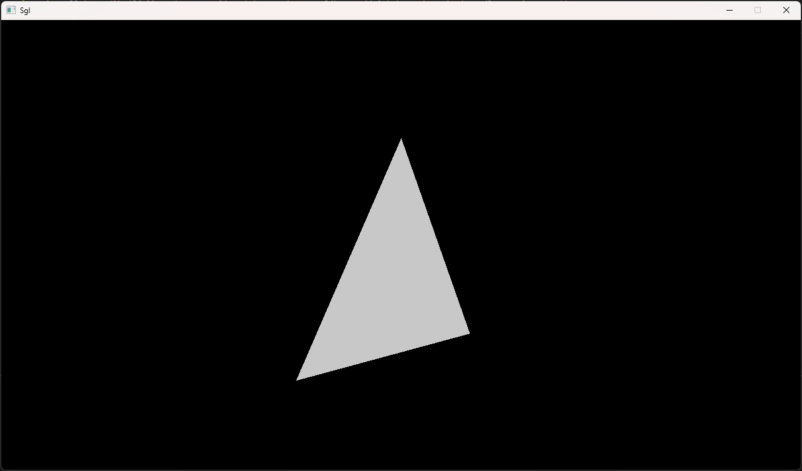

# Sgl
Sgl (Software Graphics Library) is a 3D software rendering engine written in Go

## Dependencies
- [go-sdl](https://github.com/veandco/go-sdl2)

## How to run
- install `go-sdl` ([follow the steps listed under Requirements](https://github.com/veandco/go-sdl2#requirements))
- clone this repo
- run: `go run .` from within the folder `main`